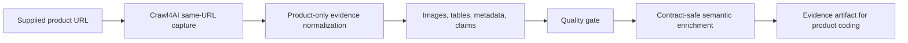

# Product Scraping Agent

A clean, isolated **product URL → product-only retailer evidence artifact** runtime.

This repository intentionally contains only product scraping runtime code. It does **not** contain URL search/discovery, product coding, reporting spreadsheets, Streamlit UI, Docker search infrastructure, or rulebook logic.

## Current release

```text
Version: 1.3.5
Backend: Crawl4AI only
Scope  : supplied product URL only; no search and no alternate URL discovery
Output : high-grade product evidence artifact for downstream product coding
```

## Documentation map

| Document | Purpose |
|---|---|
| [Documentation index](docs/index.md) | Main navigation |
| [Architecture](docs/architecture.md) | Mermaid component flow, sequence diagram, access-attempt flow, lifecycle state diagram |
| [Usage guide](docs/usage.md) | Install, preflight, single URL, batch, audit, triage, quality checks |
| [Artifact contract](docs/artifact_contract.md) | Batch CSV schema, artifact folder schema, evidence axes, semantic enrichment |
| [Runbook](docs/runbook.md) | Review/retry/rescrape operations guide |
| [ADRs](docs/adr/README.md) | Architecture decision records |

## What this tool does



## Runtime contract

| Layer | Contract |
|---|---|
| Input | `product_url` plus optional identity/source hints |
| Runtime | Crawl4AI-only, same supplied URL, no search |
| Output | One artifact folder per input row |
| Quality | Deterministic readiness gate and business validation |
| Downstream | Product-coding engine consumes artifact as evidence |

Optional identity/source hints help provenance, image relevance, and wrong-product detection. They never trigger search.

## Same-URL capture profiles

The scraper can try these profiles against the same supplied URL:

```text
standard
load_wait
full_page_scroll
expand_common_sections
extract_gallery_sources
shadow_iframe
retry_relaxed
```

Each profile is scored for real product evidence. A thin HTTP-200 shell is not treated as a high-grade scrape.

## Evidence axes

| Axis | Meaning |
|---|---|
| `T` | Rendered product text |
| `V` | Visual evidence |
| `S` | Structured metadata, JSON-LD, meta tags |
| `D` | HTML tables |
| `I` | Input context |
| `U` | URL-derived evidence |
| `A` | Upstream caller-supplied evidence |

## Install

### Core runtime

```bash
pdm install --prod
pdm run playwright install chromium
```

### Test tooling

```bash
pdm install -G test
pdm run quality-check
```

### Notebook tooling

```bash
pdm install -G notebook
```

## Runtime preflight

```bash
pdm run runtime-preflight \
  --output-root data/scraped \
  --report-json data/runtime_preflight.json
```

With browser launch check:

```bash
pdm run runtime-preflight \
  --output-root data/scraped \
  --check-browser-launch
```

## Run single URL

```bash
pdm run scrape-url \
  --url "https://retailer.example/product/123" \
  --main-text "Toy product title" \
  --ean "1234567890123" \
  --requested-retailer-name "Requested Retailer" \
  --requested-country-code "CZ" \
  --source-retailer-name "Actual URL Retailer" \
  --source-country-code "CZ" \
  --source-url-role "primary_requested_retailer" \
  --output-root data/scraped
```

## Run batch

```bash
pdm run scrape-batch \
  --input-csv data/batch_input.csv \
  --output-csv data/batch_scrape_output.csv \
  --summary-json data/batch_scrape_summary.json \
  --preflight-json data/batch_preflight.json \
  --runtime-preflight-json data/runtime_preflight.json \
  --output-root data/scraped \
  --max-concurrency 2 \
  --resume
```

Recommended input CSV:

```csv
input_id,product_url,main_text,ean,requested_retailer_name,requested_country_code,source_retailer_name,source_country_code,source_url_role
P001,https://retailer.example/product/123,Toy product title,1234567890123,Requested Retailer,CZ,Actual URL Retailer,CZ,primary_requested_retailer
```

Semantic enrichment runs after batch artifact creation by default. To skip it:

```bash
--skip-semantic-enrichment
```

## Expected artifact structure

```text
data/scraped/<input_id>/
├── request.json
├── scrape_result.json
├── _COMPLETE.json or _FAILED.json
└── retailer/
    ├── source.md
    ├── product_evidence.json
    ├── product_evidence.md
    ├── claims.md
    ├── vision.md
    ├── metadata.json
    ├── quality_report.json
    ├── source_alignment_report.json
    ├── evidence_recovery_report.json
    ├── noise_report.json
    ├── images/
    ├── tables/
    └── manifests/
        ├── agent_trace.json
        ├── artifact_manifest.json
        ├── image_manifest.json
        └── table_manifest.json
```

## Quality interpretation

| Signal | Meaning |
|---|---|
| `success=true` | Artifact was created, not necessarily coding-ready |
| `real_scrape_evidence=true` | Crawl4AI captured meaningful product-page evidence |
| `visual_evidence_status=final_product_images_available` | Clean product visual evidence is present |
| `requires_manual_review=true` | Do not send directly to automated product coding without inspection |
| `semantic_enrichment.coding_readiness.ready_for_coding=true` | Artifact passed identity, quality, visual, and review gates |

## Post-run commands

Artifact audit:

```bash
pdm run audit-artifacts \
  --output-root data/scraped \
  --output-csv data/artifact_audit.csv \
  --summary-json data/artifact_audit_summary.json
```

Batch triage:

```bash
pdm run triage-batch \
  --input-csv data/batch_scrape_output.csv \
  --output-csv data/batch_triage.csv \
  --summary-json data/batch_triage_summary.json
```

## No-search boundary

The scraper never performs web search or URL discovery. If upstream systems already produced indexed snippets or AI Mode evidence, they can be passed explicitly as recovery evidence. Those claims are tagged as `A` evidence axis and remain distinguishable from browser-rendered page evidence.
