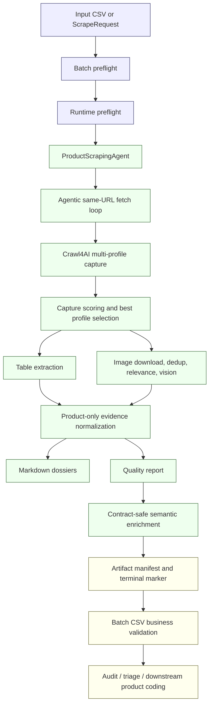
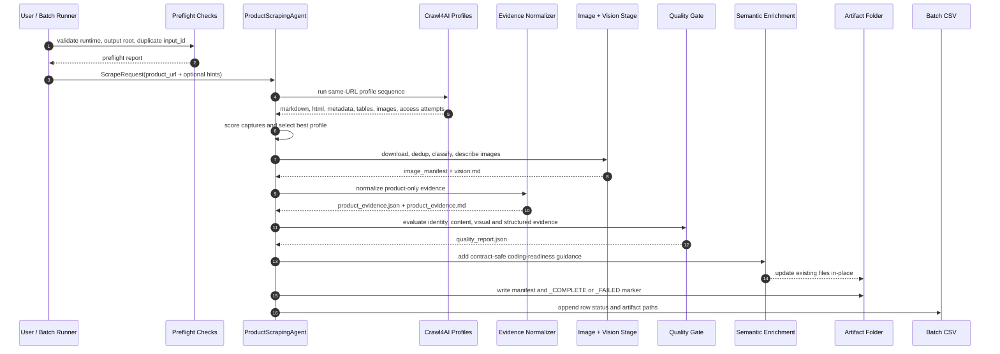
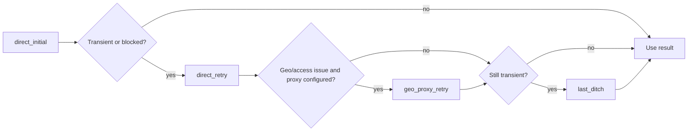
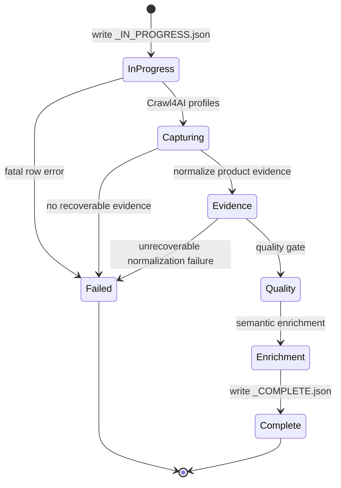

# Architecture

Product Scraping Agent is a **URL-in / artifact-out** runtime. It does not discover URLs and it does not code product features. Its responsibility is to convert a supplied product URL into a high-grade, product-only evidence artifact for downstream coding.

## Design boundary

| Concern | In scope | Out of scope |
|---|---:|---:|
| Supplied product URL scraping | ✅ |  |
| Same-URL dynamic capture | ✅ |  |
| Product-only evidence normalization | ✅ |  |
| Image/table/metadata extraction | ✅ |  |
| Artifact quality/readiness gating | ✅ |  |
| URL search/discovery |  | ❌ |
| Product feature coding |  | ❌ |
| Rulebook interpretation |  | ❌ |
| Reporting spreadsheets |  | ❌ |

## Component flow

## Runtime sequence

## Same-URL capture profiles

The scraper can run these capture profiles against the **same supplied URL**:

| Profile | Purpose |
|---|---|
| `standard` | Basic Crawl4AI render and extraction |
| `load_wait` | Longer page-load wait for JS-heavy retailers |
| `full_page_scroll` | Scroll page to trigger lazy-loaded text/images |
| `expand_common_sections` | Click visible product accordions/tabs like specifications, details, safety, manufacturer |
| `extract_gallery_sources` | Stimulate gallery/thumb/carousel nodes to expose product image URLs |
| `shadow_iframe` | Process iframes and shadow DOM when supported |
| `retry_relaxed` | Last-ditch relaxed DOM capture for blocked or thin pages |

Each profile is scored and the best same-URL capture is selected. Auxiliary images, tables, JSON-LD, and metadata may be merged from other non-noisy profiles.

## Per-profile access attempts

## Evidence axes

Evidence emitted to downstream consumers is provenance-tagged across these axes:

| Axis | Meaning | Example |
|---|---|---|
| `T` | Rendered product text | Product title, description, bullets |
| `V` | Visual evidence | Package image, visible age label, piece count |
| `S` | Structured metadata | JSON-LD, Open Graph, product meta tags |
| `D` | HTML tables | Specification table rows |
| `I` | User input context | Main text, EAN, requested retailer/country |
| `U` | URL-derived evidence | Slug/canonical URL hints |
| `A` | Upstream supplied evidence | Search/AI/indexed snippets passed by caller |

## Artifact lifecycle

## Downstream handoff

The product-coding engine should normally read files in this order:

1. `retailer/quality_report.json`
2. `retailer/product_evidence.json`
3. `retailer/claims.md`
4. `retailer/vision.md`
5. `retailer/source.md`
6. `retailer/manifests/image_manifest.json`
7. `retailer/manifests/table_manifest.json`

## Non-goals

The runtime intentionally does not:

- search Google, SerpAPI, SearXNG, or other engines;
- invent alternate URLs;
- product-code features;
- interpret official rulebooks;
- silently treat fallback-source commercial claims as requested-retailer claims.
