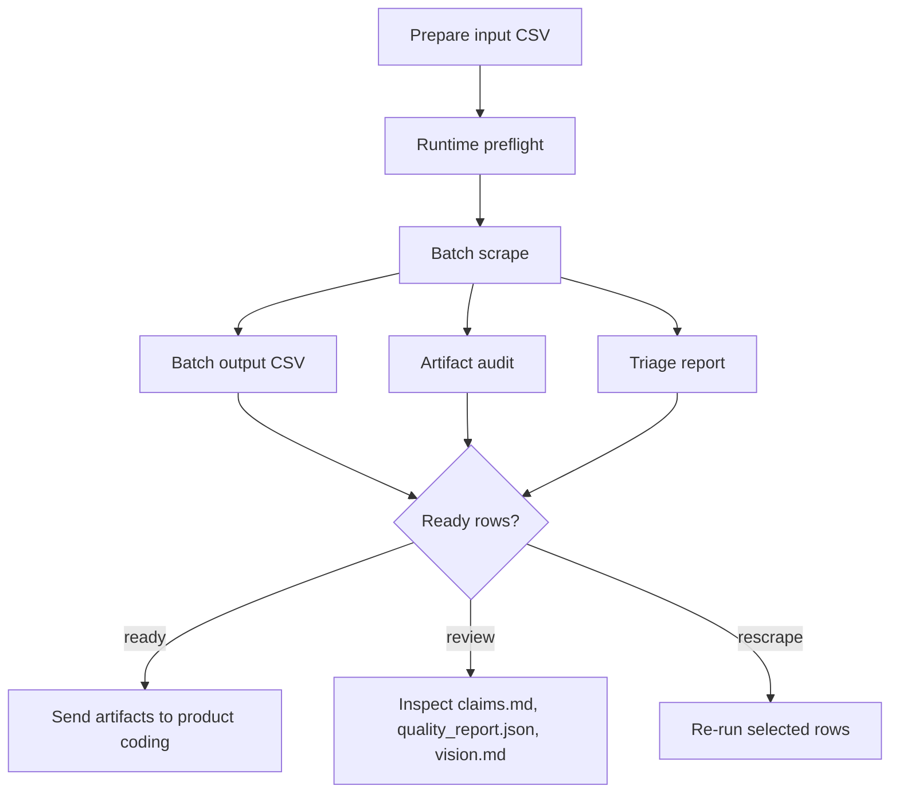

# Usage Guide

This guide covers local and AzureML-style usage for the URL-in / artifact-out product scraping runtime.

## 1. Install

### Core runtime

```bash
pdm install --prod
pdm run playwright install chromium
```

### Test tooling

```bash
pdm install -G test
pdm run quality-check
```

### Notebook tooling

```bash
pdm install -G notebook
```

## 2. Runtime settings

Create a local `.env` or inject equivalent environment variables in AzureML.

```env
PCA_LLM_ENABLED=true
PCA_LLM_ENDPOINT=<configured endpoint>
PCA_LLM_DEPLOYMENT=<configured deployment>
PCA_SCRAPE_MULTI_PROFILE_ENABLED=true
PCA_SCRAPE_PROFILE_SEQUENCE=standard,load_wait,full_page_scroll,expand_common_sections,extract_gallery_sources,shadow_iframe,retry_relaxed
PCA_SCRAPE_PROFILE_EARLY_STOP_SCORE=82
PCA_SCRAPE_PROFILE_MAX_PROFILES=7
PCA_IMAGE_REQUIRED=true
PCA_SCREENSHOT_FALLBACK_ENABLED=true
PCA_IMAGE_KEEP_UNVERIFIED_ON_VISION_FAILURE=true
```

Keep secrets out of committed files.

## 3. Runtime preflight

```bash
pdm run runtime-preflight \
  --output-root data/scraped \
  --report-json data/runtime_preflight.json
```

For browser verification:

```bash
pdm run runtime-preflight \
  --output-root data/scraped \
  --check-browser-launch
```

## 4. Single URL scrape

```bash
pdm run scrape-url \
  --url "https://retailer.example/product/123" \
  --main-text "Toy product title" \
  --ean "1234567890123" \
  --requested-retailer-name "Requested Retailer" \
  --requested-country-code "CZ" \
  --source-retailer-name "Actual URL Retailer" \
  --source-country-code "CZ" \
  --source-url-role "primary_requested_retailer" \
  --output-root data/scraped
```

## 5. Batch scrape

Minimum CSV:

```csv
input_id,product_url
P001,https://retailer.example/product/123
```

Recommended CSV:

```csv
input_id,product_url,main_text,ean,requested_retailer_name,requested_country_code,source_retailer_name,source_country_code,source_url_role
P001,https://retailer.example/product/123,Toy product title,1234567890123,Requested Retailer,CZ,Actual URL Retailer,CZ,primary_requested_retailer
```

Command:

```bash
pdm run scrape-batch \
  --input-csv data/batch_input.csv \
  --output-csv data/batch_scrape_output.csv \
  --summary-json data/batch_scrape_summary.json \
  --preflight-json data/batch_preflight.json \
  --runtime-preflight-json data/runtime_preflight.json \
  --output-root data/scraped \
  --max-concurrency 2 \
  --max-images 30 \
  --vision-max 12 \
  --max-agent-iterations 2 \
  --resume
```

Semantic enrichment runs after batch artifact creation by default. To skip it:

```bash
--skip-semantic-enrichment
```

## 6. Post-run audit and triage

Artifact audit:

```bash
pdm run audit-artifacts \
  --output-root data/scraped \
  --output-csv data/artifact_audit.csv \
  --summary-json data/artifact_audit_summary.json
```

Batch triage:

```bash
pdm run triage-batch \
  --input-csv data/batch_scrape_output.csv \
  --output-csv data/batch_triage.csv \
  --summary-json data/batch_triage_summary.json
```

## 7. Local quality checks

```bash
pdm run check-compile
pdm run check-tests
pdm run quality-check
```

## 8. Operating loop



## 9. What to inspect first

| Situation | First file to open | Why |
|---|---|---|
| Product-coding readiness | `retailer/quality_report.json` | Quality gate and semantic enrichment |
| Structured evidence | `retailer/product_evidence.json` | Primary machine-readable evidence |
| Readable summary | `retailer/claims.md` | Compact LLM-readable dossier |
| Image evidence | `retailer/vision.md` and `image_manifest.json` | Visual observations and image diagnostics |
| Source text | `retailer/source.md` | Clean product-only markdown |
| Runtime status | `scrape_result.json` | Row-level runtime result |
